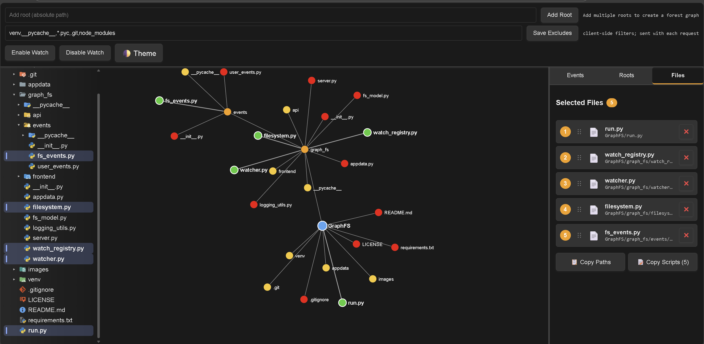

# GraphFS (Event-Driven)

A graph-based folder explorer designed for AI-driven development workflows. Select, organize, and copy multiple scripts in bulk with an intuitive force-directed graph visualization.



---

## 🎯 Purpose

GraphFS streamlines the process of sharing code context with AI assistants. Instead of manually copying files one-by-one, GraphFS lets you:

- **Visualize** your project structure as an interactive force-directed graph
- **Select** multiple files with click or lasso selection
- **Reorder** files via drag-and-drop to control narrative flow
- **Copy** all selected scripts in a numbered, formatted structure perfect for AI prompts
- **Monitor** file changes in real-time with inotify-based file watching

Perfect for developers working with AI code assistants who need to quickly gather context from multiple files across complex directory structures.

---

## ✨ Features

### Current Features

- **Multi-Root Forest Graph** - Add multiple root directories to explore several projects simultaneously
- **Interactive Graph Visualization** - Force-directed layout with D3.js for intuitive navigation
- **Smart File Selection** - Click individual files or use lasso selection for bulk operations
- **Drag-and-Drop Ordering** - Reorder selected files to control the script sequence
- **Formatted Script Output** - Copy scripts with relative paths and numbered formatting
- **Real-Time File Watching** - Live updates when files are created, deleted, or modified
- **Favorites System** - Bookmark frequently-used root directories for quick access
- **Dark/Light Theme** - Toggleable theme to match your preference
- **Client-Side Filtering** - Exclude patterns like `venv`, `node_modules`, `__pycache__`, etc.

### Potential Future Enhancements

- **In-App File Editing** - Edit scripts directly through the web interface
- **Git Integration** - Manage repositories with branching, committing, and diffing
- **Search & Filter** - Full-text search across files
- **File Preview** - Quick preview of file contents without selection
- **Collaborative Sessions** - Share your workspace with team members
- **Plugin System** - Extend functionality with custom modules

---

## 🖥️ Platform Support

**Currently tested on:** Linux (Ubuntu/Debian/WSL2)

**May work on:** macOS (untested)

**Not supported:** Windows native (due to filesystem path handling)

> ⚠️ **Note:** GraphFS relies on Unix-style file paths and inotify for file watching. Windows users should use WSL2 for the best experience.

---

## 🚀 Getting Started

### Prerequisites

- Python 3.8+
- pip
- Linux or WSL2 environment

### Installation

1. **Clone the repository**
   ```bash
   git clone https://github.com/aaricantto/GraphFS.git
   cd graphfs
   ```

2. **Set up virtual environment**
   ```bash
   python -m venv venv
   source venv/bin/activate
   ```

3. **Install dependencies**
   ```bash
   pip install -r requirements.txt
   ```

4. **Run the application**
   ```bash
   python run.py
   ```

5. **Open your browser**
   
   Navigate to **http://localhost:5098/**

6. **Add a root directory**
   
   Enter an absolute Linux file path (e.g., `/home/user/projects/myapp`) in the "Add root" input field and click **Add Root** to begin exploring!

---

## 📖 Usage Guide

### Adding Roots

- Enter an absolute path in the header input field
- Click **Add Root** or press Enter
- The root appears as a blue node in the graph

### Navigating the Graph

- **Click folders** to expand/collapse them
- **Click files** to select/deselect (selected files turn green)
- **Drag nodes** to rearrange the graph layout
- **Lasso select** by clicking and dragging on empty space to select multiple items

### Managing Selected Files

1. Switch to the **Files** tab in the sidebar
2. **Reorder** files by dragging them up or down
3. **Remove** individual files with the × button
4. **Copy Scripts** - Formats all selected text files with numbered headers and relative paths

### File Watching

- Click **Enable Watch** to monitor file changes in real-time
- The graph automatically updates when files are created, modified, or deleted
- Click **Disable Watch** to pause monitoring

### Favorites

- Star (★) a root in the **Roots** tab to save it as a favorite
- Favorites persist across sessions
- Quickly reactivate favorite roots with the ➕ button

---

## 🛠️ Configuration

### Exclude Patterns

Set custom exclude patterns in the header to filter out unwanted directories:

```
venv,__pycache__,*.pyc,.git,node_modules,dist,build
```

Click **Save Excludes** to apply. Patterns support:
- Exact folder names: `node_modules`
- Wildcards: `*.pyc`, `*.log`
- Substring matching in paths

### Application State

GraphFS stores your favorites and active roots in:
- **Linux:** `~/.local/share/graph-fs/state.json`
- **macOS:** `~/Library/Application Support/graph-fs/state.json`

Or in a local `./appdata/` directory if present in the repository.

---

## 🏗️ Architecture

### Backend (Python)

- **Flask** - Web server and API endpoints
- **Flask-SocketIO** - Real-time bidirectional communication
- **Watchdog** - Filesystem event monitoring (inotify)
- **Rich** - Beautiful terminal logging

### Frontend (JavaScript)

- **D3.js** - Force-directed graph visualization
- **Socket.IO** - Real-time client-server communication
- **ES6 Modules** - Clean, modular architecture
- **Event-driven design** - Loose coupling between UI panels

### Key Design Patterns

- **Event-driven architecture** - Custom DOM events for inter-component communication
- **Observer pattern** - File watching with surgical DOM updates
- **Model-View separation** - Backend manages state, frontend handles presentation
- **Persistent state** - JSON-backed favorites and session restoration

---

## 📂 Project Structure

```
graphfs/
├── run.py                          # Application entry point
├── requirements.txt                # Python dependencies
├── graph_fs/
│   ├── __init__.py
│   ├── server.py                   # Flask + SocketIO server
│   ├── fs_model.py                 # Multi-root filesystem model
│   ├── watch_registry.py           # Inotify observer management
│   ├── appdata.py                  # Persistent state (favorites)
│   ├── logging_utils.py            # Rich-based logging
│   └── frontend/
│       ├── index.html
│       ├── index.js                # Module loader
│       ├── socket-manager.js       # WebSocket communication
│       ├── utility.js              # Theme and controls
│       ├── nodes/
│       │   ├── nodes.js            # Graph data and interactions
│       │   └── graph-renderer.js   # D3 visualization
│       ├── sidebar/
│       │   ├── sidebar-manager.js  # Tab orchestration
│       │   ├── events-panel.js     # Event log display
│       │   ├── roots-panel.js      # Root management
│       │   └── files-panel.js      # File ordering & copying
│       └── styles/
│           ├── variables.css       # Theme tokens
│           └── styles.css          # Application styles
```

---

## 🤝 Contributing

Contributions are welcome! Areas for improvement:

- Cross-platform support (Windows, macOS testing)
- Performance optimization for large directory trees
- UI/UX enhancements
- Additional file type support
- Git integration features

---

## 📝 License

AGPL-3.0

---

## 🙏 Acknowledgments

- **D3.js** for the incredible graph visualization library
- **Flask-SocketIO** for seamless real-time communication
- **Watchdog** for reliable filesystem monitoring
- **Rich** for beautiful terminal output

---

## 📧 Contact

mail@aricanto.com

---

**Happy Coding! 🚀**
